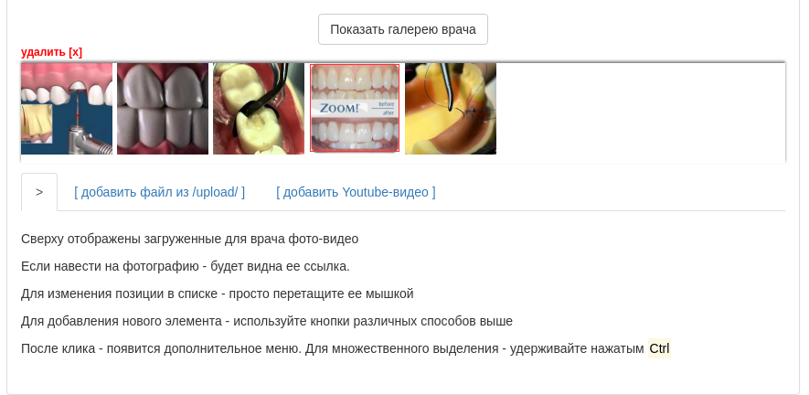

# yii2 Admin Mixed Gallery

## Установка / Install

`composer require lg-xenos/yii2-adm-mixed-galery`

**`backend/view/test/test.php`**
```php
echo  $form->field($model, 'doc_gallery')
      ->widget(\lgxenos\yii2\admMixedGallery\AdmMixedGallery::className())->label(false)
```



